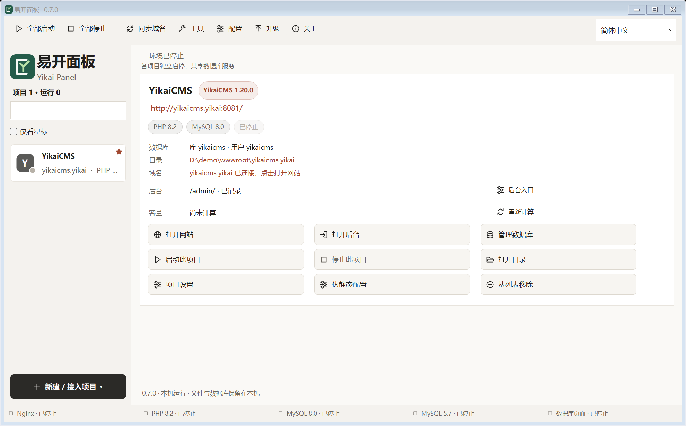
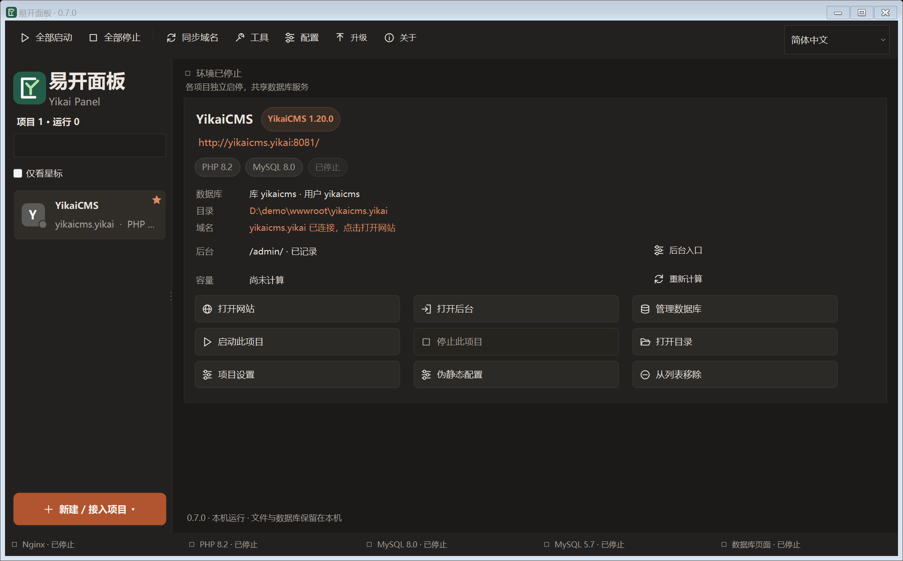
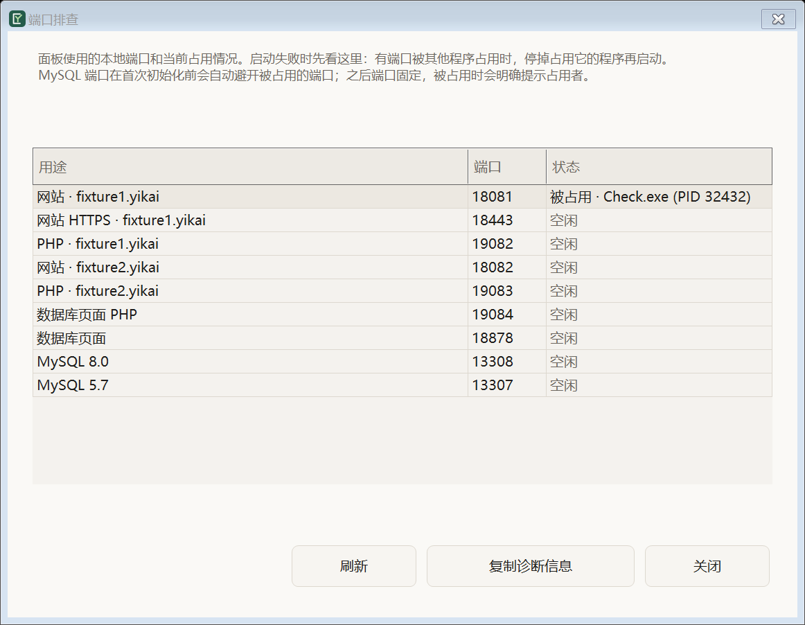

<div align="center">



# 易开面板 · Yikai Panel

**Windows 上的本地 PHP 开发环境：装一次，双击就能跑多个网站。**

Nginx / Apache + PHP 8.0 / 8.2 / 8.5 + MySQL 5.7 / 8.0 + SQLite · 图形界面 · 中文 / English / 日本語

[官网](https://panel.yikai.cn) · [下载安装包](https://panel.yikai.cn) · [问题反馈](https://github.com/bluesailor/yikai-panel/issues)

当前源码版本 **0.7.4** · 各版本改动见 [CHANGELOG](CHANGELOG.md)

</div>

---

## 这是什么

易开面板把「本地跑一个 PHP 网站」需要的整套东西收进一个 Windows 窗口：Web 服务器、多个 PHP 版本、
两套 MySQL、SQLite、数据库管理页面、HTTPS 本地证书、伪静态编辑、PHP 扩展勾选、局域网访问。
面向不熟悉服务器配置的人：不用命令行、不用 Docker、不用 WSL、不用自己配 Nginx 和 php.ini。

- **一条路走到能访问**：新建项目 → 自动建目录、建库、建站点配置 → 点“打开网站”。
  项目类型可选空白 PHP（默认）、YikaiCMS 最新版、WordPress 最新版（从 wordpress.org 官方下载并校验，自动生成 `wp-config.php`），或接入已有目录。
- **每个项目独立**：自己的域名、PHP 版本、数据库、HTTPS、伪静态规则，互不影响。
- **域名不用管 hosts**：名字不带后缀时默认补 `.localhost`（如 `demo.localhost`），浏览器直接解析到本机，不写 hosts、不弹管理员授权。
  需要 `.yikai` 这类域名时，勾选新建对话框里的“同步 hosts”，建完自动写入（Windows 会请求一次管理员授权）。
  注意 `.localhost` 只有浏览器认，命令行 curl 或 PHP 在 Windows 上解析不到这个域名。
- **检测更新**：YikaiCMS / WordPress 项目可一键查询官方最新版本，只显示结果，不改动站点文件。
- **桌面数据库客户端**：装有 HeidiSQL 便携版（`soft\heidisql`）时，点项目的“数据库”一行即可用它直接连上该项目的 MySQL 或 SQLite，连接信息自动填好。
- **端口自己会让路**：默认从 8081 / 8443 / 3308 这类开发端口起步，被占用时自动避开；
  需要生产式地址时可以把端口指定成 80 / 443 / 3306 并固定（被占用会直接告诉你占用者是谁）。
- **出问题能自查**：“工具 → 端口排查”列出每个端口现在被谁占着（进程名 + PID）并支持一键复制诊断信息；
  启动失败会指名端口占用者并附上服务日志。
- **从 PHPStudy 搬项目**：扫描现有 PHPStudy 站点，把文件与数据库（含空表、视图、触发器、存储过程）复制成独立项目，原环境不动。
- **扫描目录快速导入**：已经在本机、从别处复制过来的站点目录，不用一个个接入——点“新建 / 接入项目 → 扫描目录快速导入”，选个目录，面板列出里面的子目录让你勾选，一次登记成项目。
  名字带点的目录直接用目录名当域名（`demo.yikai`）；不带点的英文/数字/`-`/`_` 名字可以勾选“同时添加不带点的目录”自动补 `.localhost`（`yikaiflow` → `yikaiflow.localhost`），中文、空格、隐藏目录会跳过并逐条写明原因。登记只写面板配置：不复制文件、不覆盖目录里已有的 `index.php`。
- **三语界面**：中文 / English / 日本語，深浅主题、字号、编程字体都可调。

## 一键部署 YikaiCMS

新建 YikaiCMS 项目时，面板会**自动完成全部步骤**，不用进安装向导：

1. 从官方地址下载最新版 YikaiCMS（默认 `https://down.yikai.cn/soft/yikaicms/yikaicms-latest.zip`，可在 `config/panel.json` 的 `cmsPackageUrl` 改）并缓存到 `soft/cache`，同版本不重复下载；
2. 建目录、建数据库（MySQL 8.0 / 5.7 或 SQLite，可带项目专属数据库账号）；
3. 启动后调用 CMS 自带的安装接口写 `config/config.php`、建表并创建管理员；
4. 页面提示 `CMS 已安装 · 后台 admin / yikai888`，直接点“打开后台”就能登录。

后台账号可在 `panel.json` 里改（`cmsAdminUser` / `cmsAdminPassword`），关掉自动安装用 `autoInstallCms: false`。
下载失败时不再阻塞：会改写日志说明原因（含 HTTP 状态码），此时项目仍可在浏览器里用安装向导完成；本机已有缓存或随包模板时优先离线使用。

命令行同样支持：`--create-site demo --template yikaicms`（加 `--no-auto-install` 可跳过自动安装）。

## 最小环境包（nginx + PHP 8.5 + MySQL 8.0）

`packages\YikaiPanel-0.7.0-minimal-setup-x64.exe`（约 80 MB，完整包约 171 MB）：

- 只带 Nginx、PHP 8.5、MySQL 8.0、面板本体、数据库页面；不含 Apache、MySQL 5.7、PHP 8.0 / 8.2、CMS 模板与默认站点；
- 首次新建 YikaiCMS 项目时在线获取 CMS（需要联网），之后走缓存；
- 面板内部用哪个 PHP 会自动解析（优先 8.2，没有就用已装版本），默认 PHP 版本与默认站点也会自愈到实际存在的版本；
- VC++ 运行库不再装 24 MB 的安装器，改为随包带 `vcruntime140.dll` / `vcruntime140_1.dll` / `msvcp140.dll`（约 750 KB，放在 PHP 目录里；MySQL 8.0 自带这几个 DLL）。

## 截图

| 主界面 | 深色主题 |
| --- | --- |
|  |  |

| 端口排查（启动失败先看这里） |
| --- |
|  |

## 安装

1. 到 [官网](https://panel.yikai.cn) 下载 `YikaiPanel-<版本>-setup-x64.exe`（约 170 MB，完整离线环境）。
2. 双击安装：默认装到 `D:\yikai`（没有 D 盘时用安装盘下的 `yikai`），安装过程不需要管理员权限。
3. 打开面板，第一次会自动初始化 MySQL 并启动环境（约 30–60 秒），然后就能新建网站。

默认值：默认网站 `yikaicms.yikai`、网站目录 `<安装目录>\wwwroot`、MySQL 8.0 root / 123456、
数据库页面 `http://127.0.0.1:8878`。详细说明见安装包内的《交付说明》。

**系统要求**：Windows 10 / 11 x64。安装包内置 .NET 运行时与全部组件，使用过程不需要联网。

## 从源码构建

需要 .NET 9 SDK（本项目在 9.0.317 上开发）：

```powershell
git clone https://github.com/bluesailor/yikai-panel.git
cd yikai-panel
dotnet publish src\YikaiPHP.csproj -c Release -r win-x64 --self-contained true `
  -p:PublishSingleFile=true -p:EnableCompressionInSingleFile=true -p:DebugType=None `
  -o <某个安装目录>\soft\panel
```

面板二进制是位置无关的：把它放在 `<根目录>\soft\panel\YikaiLocal.exe`，
它会用上两级目录作为根目录，其他目录按需创建：

```text
<根目录>\
├─ soft\panel\YikaiLocal.exe     面板本体（唯一必须的文件）
├─ soft\php\<版本>\              PHP 运行环境（把 php.ini 里的路径改成你的根目录）
├─ soft\mysql\<版本>\            MySQL 运行环境
├─ soft\nginx\  soft\apache\<版本>\  Web 服务器
├─ soft\db-manager\              数据库页面（首次启动时从 EXE 内嵌资源释放）
├─ config\  wwwroot\  data\  logs\  temp\  backups\
```

运行环境组件不随源码分发，按 `preparation/component-manifest.json` 记录的版本与来源自备。
自带测试与验收脚本（见下）可以只对着 `src/` 编出来的面板跑，用来核对改动。

## 代码结构

| 路径 | 内容 |
| --- | --- |
| `src/` | 面板本体（C# / WinForms，.NET 9，自包含单文件发布）。59 个 C# 源文件、约 5.2k 行 |
| `src/Assets/DatabaseTools/` | 数据库页面与迁移工具（PHP，编译进 EXE 后在首次启动时释放到 `soft/db-manager`） |
| `docs/` | 开发说明与配置格式；产品规格、发布流程等内部文档不在本仓库 |
| `design/` | 图标与品牌素材原图 |
| `preparation/` | 打包与验收脚本、组件清单、历次验证报告 |

面板的功能与变更记录见 [`CHANGELOG.md`](CHANGELOG.md)（原 README 的开发记录）。

## 验收脚本

项目里的每个功能都带可复跑的验证脚本（隔离根目录，不动本机开发环境），例如：

| 脚本 | 覆盖 |
| --- | --- |
| `preparation/release-0.7.0/acceptance.ps1` | 安装 / 启动 / 重复安装 / 卸载四段，67 项 |
| `preparation/port-settings/verify-ports.ps1` | 常用端口：被占用拒绝并指名占用者、指定端口生效、改库端口同步站点配置，29 项 |
| `preparation/port-qa/checks/`、`preparation/ui-project-badges/checks/` | 界面检查（三语 × 字号 × 十三个对话框的布局与裁切），765 项 |

```powershell
# 公开前检查：只扫描 Git 能看到、准备纳入仓库的文件
powershell -ExecutionPolicy Bypass -File preparation\github\check-publish.ps1
```

## 参与

- 问题与建议：GitHub Issues（带上“工具 → 端口排查”里复制的诊断信息和运行日志片段，通常一眼能定位）。
- 提交代码前请跑一遍受影响的验收脚本；界面改动请跑 `preparation/ui-project-badges/checks`。
- 邮件：support@yikay.com

## 授权

本仓库采用 [Apache License 2.0](LICENSE) 开源：允许使用、修改、再分发和商业使用，并提供明确的贡献者专利授权；分发时须遵守许可证中的保留声明、标注修改等条件。

- “易开面板 / Yikai Panel”名称、Logo 和应用图标不随代码许可授权。合理署名与描述性使用可以直接进行；第三方修改版应使用不同名称和图标，详见 [TRADEMARKS.md](TRADEMARKS.md)。
- 版权及署名信息见 [NOTICE](NOTICE)，第三方组件保留各自许可，详见 [THIRD-PARTY-NOTICES.md](THIRD-PARTY-NOTICES.md)。
- **YikaiCMS 不包含在本仓库内**：它是独立产品，适用自己的许可协议（见
  [bluesailor/yikaicms](https://github.com/bluesailor/yikaicms)）；面板只是支持把它作为项目模板安装到本机。

---

## English

**Yikai Panel** is a local PHP development environment for Windows: one installer, one window, and you
can run multiple websites with Nginx or Apache, PHP 8.0 / 8.2 / 8.5, MySQL 5.7 / 8.0 and SQLite.

- Create a project and it makes the folder, the database and the vhost for you. Project types: blank PHP,
  the latest YikaiCMS, the latest WordPress (downloaded from wordpress.org and checksum-verified), or an existing folder.
- Every project keeps its own domain, PHP version, database, HTTPS certificate and rewrite rules.
- Names without a suffix become `name.localhost`, which browsers resolve to this computer on their own: no hosts
  file and no admin prompt. For `.yikai`-style domains, keep “Sync hosts” checked and the entry is written after
  creation (one Windows admin prompt). `.localhost` works in browsers only; curl and PHP on Windows cannot resolve it.
- One-click update check for YikaiCMS / WordPress projects, and one-click HeidiSQL connection when the portable
  HeidiSQL is present in `soft\heidisql`.
- Development ports (8081 / 8443 / 3308) move out of the way automatically; you can pin standard ports
  (80 / 443 / 3306) instead, and the panel will tell you exactly which process holds a port if it is taken.
- A built-in port diagnostics window, LAN access for colleagues, SSL certificates from a local root CA,
  PHP extension toggles, and a PHPStudy import that copies sites and databases without touching the original.
- UI in Chinese, English and Japanese; light and dark themes; adjustable font sizes.

Download the installer from <https://panel.yikai.cn> (Windows 10/11 x64, fully offline, no admin rights needed).
Build from source with the .NET 9 SDK — see the Chinese section above for the exact commands and layout.

Open source under the [Apache License 2.0](LICENSE). The license permits use, modification,
redistribution, and commercial use, subject to its notice and attribution requirements. The “Yikai
Panel / 易开面板” names and logos are governed separately by the [trademark policy](TRADEMARKS.md).
Third-party components retain their own licenses; see [THIRD-PARTY-NOTICES.md](THIRD-PARTY-NOTICES.md).
YikaiCMS is a separate product and is **not** part of this repository.

---

## 日本語

**Yikai Panel（易开面板）**は、Windows 向けのローカル PHP 開発環境です。1つのインストーラーと
1つの画面から、Nginx または Apache、PHP 8.0 / 8.2 / 8.5、MySQL 5.7 / 8.0、SQLite を使う
複数の Web サイトを実行できます。

- プロジェクトを作成すると、フォルダー、データベース、仮想ホストを自動で準備します。種類は空の PHP、最新の YikaiCMS、最新の WordPress（wordpress.org から取得して検証）、既存フォルダーから選べます。
- プロジェクトごとにドメイン、PHP バージョン、データベース、HTTPS 証明書、リライトルールを個別に管理できます。
- 末尾なしの名前は `name.localhost` になり、ブラウザーが自動でこの PC に解決するため hosts も管理者権限も不要です。`.yikai` などのドメインは「hosts を同期」で作成後に登録します（管理者の確認が 1 回表示されます）。`.localhost` はブラウザー専用で、Windows 上の curl や PHP からは解決できません。
- YikaiCMS / WordPress の更新確認、`soft\heidisql` に HeidiSQL ポータブル版がある場合のワンクリック接続に対応しています。
- 開発用ポート（8081 / 8443 / 3308）が使用中なら自動で空きポートを選びます。80 / 443 / 3306 に固定することもでき、競合時は使用中のプロセスを表示します。
- ポート診断、LAN 共有、ローカル認証局による SSL 証明書、PHP 拡張機能の切り替え、元の環境を変更しない PHPStudy 移行に対応しています。
- UI は中国語、英語、日本語に対応し、ライト／ダークテーマと文字サイズを変更できます。

インストーラーは [GitHub Releases](https://github.com/bluesailor/yikai-panel/releases/latest) からダウンロードできます
（Windows 10 / 11 x64、管理者権限は不要です）。ソースからビルドする場合は .NET 9 SDK が必要です。

本プロジェクトは [Apache License 2.0](LICENSE) で公開されています。「Yikai Panel / 易开面板」の名称と
ロゴは [商標ポリシー](TRADEMARKS.md) の対象です。第三者コンポーネントのライセンスは
[THIRD-PARTY-NOTICES.md](THIRD-PARTY-NOTICES.md) を参照してください。YikaiCMS は別製品であり、
このリポジトリには含まれていません。
